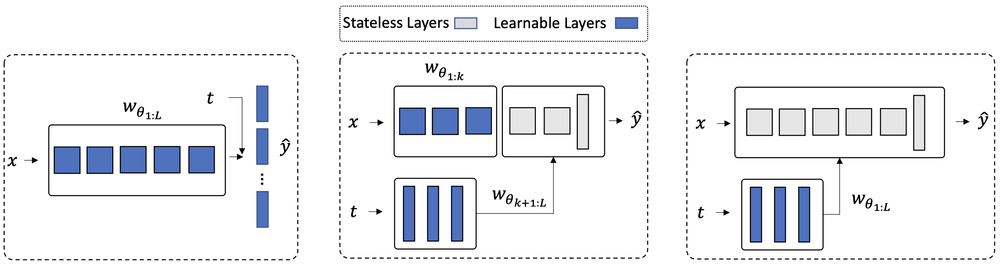

# Partial Hypernetworks for Continual Learning
This repository contains the official PyTorch implementation of "[Partial Hypernetworks for Continual Learning](https://arxiv.org/abs/2306.10724)", accepted to the Conference on Lifelong Learning Agents (CoLLAs - 2023).


<p align="center">
  
</p>

## Structure
The code structure is inspired by the [Avalanche](https://github.com/ContinualAI/avalanche) library. 

    
    ├── hyper_cl                      # PartialHyperCL as a package
        ├── benchmarks
            ├── ...                   # benchmark generators
        ├── metrics
            ├── ...                   # metrics used for the experiments
        ├── models
            ├── ...                   # models used for the experiments
        ├── plugins
            ├── ...                   # Avalanche-based plugins
        ├── strategies
            ├── ...                   # strategies implemented and used in the experiments
        ├── utils
            ├── ...                   # misc. utilities
    
    ├── experiments                   # contains scripts and notebooks used for running experiments
                                      # and visualization 
        ├── configs
            ├── ...                   # default hydra configs
        ├── notebooks
            ├── ...                   # notebooks used for visualization
        ├── scripts
            ├── ...                   # scripts for reproducing results in the paper
        train_incremental.py          # main trainer for incremental-learning experiments
        train_multitask.py            # main trainer for joint-training experiments
        

## Running an experiment

This repository is based on the Avalanche library. You can first create a conda enviroment and install required packages using `environment.yml`:

1. **Install [conda](https://docs.conda.io/projects/conda/en/latest/user-guide/install/download.html)**

2. **Clone the repo** and **create the conda environment**:
```bash
git clone https://github.com/HamedHemati/CIR.git
conda env create -f environment.yml
```

Then, start an experiment using the scripts provided under `experiments/scripts`:

3. **Start training (example: partial hypernetwork with different depths)**: 

```bash
python -m experiments.train_incremental --multirun \
        experiment=hyper-alg-reg-NM_scifar100 n_classes=10 input_size=32 \
        model=HyperResNet18SH,HyperResNet18SPv1SH,HyperResNet18SPv2SH,HyperResNet18SPv3SH,HyperResNet18SPv4SH \
        model_params.embd_dim=32 model_params.hidden_size_1=50 \
        model_params.hidden_size_2=32 model_params.head_emb_dim=32 \
        optimizer=Adam optim_params.lr=0.001 \
        strategy_params.coef_hnet_replay=0.5 strategy_params.second_order=False \
        strategy_params.train_epochs=100 num_workers=5 device=cpu 
```
